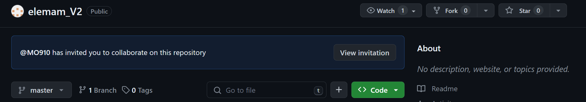
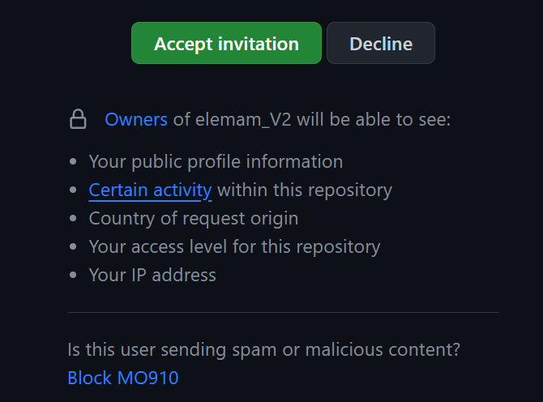

## او خطوة تخش على الريبو من الحساب بتاعك "MoSalem2004"

### [aelemam_V2](https://github.com/MO910/elemam_V2)

## بعدين تدوس "View invitation"



## بعدين تدوس "Accept invitation" اللي لونها اخضر



## تروح تعمل مجلد جديد فاضي وتفتحه من cli وتنفذ السطور الجاية بالترتيب

```cli
git clone https://github.com/MO910/elemam_V2.git
cd elemam_V2
```

## بعد ما تعمل تعديل عايز ترفعه تروح على cmdr وتعمل كوميت بوصف مناسب (مناسب ها)

```cli
git add . && git commit -m "وصف مناسب"
```

## بعدين تعمل بوش

```cli
git remote add origin https://github.com/MO910/elemam_V2.git
git push -u origin master
```
